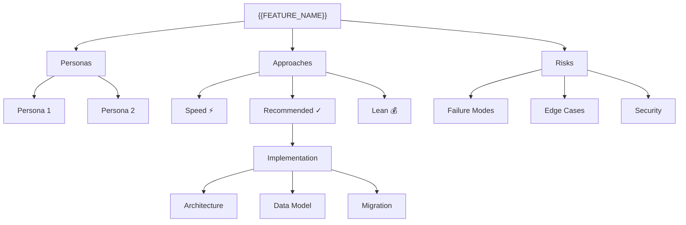

# {{FEATURE_NAME}} — Product Proposal

> Generated by `/ideate` on {{DATE}}

## Quick Navigation by Role

| Your Role       | Start Here                                          | Time  |
|-----------------|-----------------------------------------------------|-------|
| Executive       | [Summary](./SUMMARY.md)                             | 2 min |
| Product Manager | [Comparison Matrix](./COMPARISON.md)                | 5 min |
| Engineer        | [Recommended Approach](./approaches/approach-recommended.md) | 10 min |
| Skeptic         | [Edge Cases & Risks](./edge-cases/INDEX.md)         | 5 min |
| Designer        | [Personas](./personas/INDEX.md)                     | 5 min |
| Researcher      | [Research & Sources](./research/INDEX.md)            | 10 min |

## Full Document Map

### Core
- [PRD](./core/PRD.md) — Core product requirements
- [Desired Outcome](./core/OUTCOME.md) — Success metrics and goals
- [Assumptions](./core/ASSUMPTIONS.md) — What we're betting on (challengeable)

### Research (backing every claim)
- [Research Overview](./research/INDEX.md) — How research was conducted
- [Market & Competitive Dossier](./research/DOSSIER.md) — Full landscape research
- [Fact-Check Report](./research/FACT-CHECK.md) — Claim verification results
- [Competitive Landscape](./research/COMPETITIVE-LANDSCAPE.md) — Competitor deep dive
- [Industry Benchmarks](./research/BENCHMARKS.md) — Real-world data points
- [All Sources](./research/SOURCES.md) — Master citation registry

### Personas
- [Overview](./personas/INDEX.md) — Who we're building for
- [Persona Matrix](./personas/PERSONA-MATRIX.md) — Cross-persona feature priorities

### Approaches
- [Comparison](./approaches/INDEX.md) — Side-by-side approach analysis
- [Recommended](./approaches/approach-recommended.md) — Synthesized best path
- [Speed-Optimized](./approaches/approach-speed.md) — Ship fast, iterate later
- [Lean/Cost-Optimized](./approaches/approach-lean.md) — Minimize investment
- [Tradeoff Matrix](./approaches/TRADEOFF-MATRIX.md) — Weighted scores + sensitivity

### Edge Cases & Risks
- [Overview](./edge-cases/INDEX.md) — What could go wrong
- [Failure Modes](./edge-cases/failure-modes.md) — Pre-mortem scenarios
- [Scale Scenarios](./edge-cases/scale-scenarios.md) — Behavior under growth
- [Security](./edge-cases/security.md) — Security model and threat analysis

### What-If Scenarios
- [Navigator](./what-if/INDEX.md) — Explore alternative constraints
- [Budget Constrained](./what-if/budget-constrained.md)
- [Timeline Compressed](./what-if/timeline-compressed.md)
- [Scope Expanded](./what-if/scope-expanded.md)

### Technical Details
- [Architecture](./technical/architecture.md)
- [Data Model](./technical/data-model.md)
- [Integration Points](./technical/integration-points.md)
- [Migration Strategy](./technical/migration.md)

### Decisions
- [Decision Log](./decisions/INDEX.md) — Why we chose what we chose

### Meta
- [Open Questions](./meta/OPEN-QUESTIONS.md) — Items needing human decision
- [Glossary](./meta/GLOSSARY.md) — Terms used across documents
- [Generation Log](./meta/GENERATION-LOG.md) — Agent pipeline trace

---

## Solution Tree (Visual)

---

*This proposal was generated through multi-agent analysis (PM, UX, Engineering,
Business, Red Team) with structured debate and synthesis. See
[Generation Log](./meta/GENERATION-LOG.md) for the full agent pipeline trace.*
