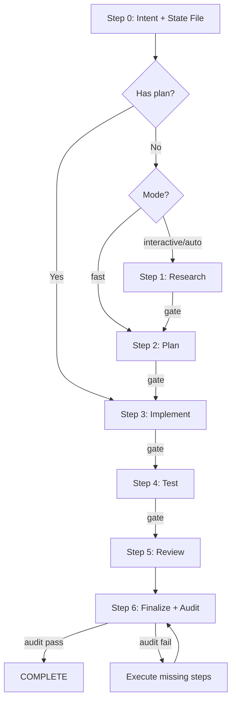

# Proposal — Deterministic Feature Implementation

State-tracked workflow that enforces every step runs to completion. No skipped steps, no silent failures.

**Principles:** YAGNI, KISS, DRY | Every step writes a checkpoint | Audit catches skips

## Usage

```
/proposal <natural language task OR plan path> [--interactive|--fast|--parallel|--auto|--no-test]
```

Default: `--interactive` (stops at review gates for human approval).

<HARD-GATE>
Do NOT write implementation code until a plan exists and has been reviewed.
This applies regardless of task simplicity. "Simple" tasks hide the most assumptions.
Exception: `--fast` mode skips research but still requires a plan step.
User override: If user explicitly says "just code it" or "skip planning", respect their instruction.
</HARD-GATE>

## Anti-Rationalization

| Thought | Reality |
|---------|---------|
| "This is too simple to plan" | Simple tasks have hidden complexity. Plan takes 30 seconds. |
| "Let me just start coding" | Undisciplined action wastes tokens. Plan first. |
| "I'll handle testing/review later" | Later = never. The state file will catch you. |
| "The finalize step isn't important" | 3 mandatory agents. Audit will fail without them. |
| "Just this once I'll skip" | Every skip is "just this once." The audit has no exceptions. |

## Smart Intent Detection

| Input Pattern | Mode | Behavior |
|---------------|------|----------|
| Path to `plan.md` or `phase-*.md` | code | Execute existing plan |
| Contains "fast", "quick" | fast | Skip research |
| Contains "trust me", "auto" | auto | Auto-approve all |
| Lists 3+ features OR "parallel" | parallel | Multi-agent |
| Contains "no test", "skip test" | no-test | Skip testing |
| Default | interactive | Full workflow |

See `references/intent-detection.md` for full detection logic.

## Workflow State Protocol (MANDATORY)

**Every workflow creates and maintains a `.proposal-state.md` file.** This is the enforcement mechanism.

1. **Step 0** creates the state file in the plan directory
2. **Every step** updates the state file via `Edit` tool after completion
3. **Every step** verifies the previous step's checkpoint via `Grep` before starting
4. **Step 6** runs a completion audit via `Bash` that validates ALL checkpoints

**If the state file shows pending steps at workflow end, the workflow is INCOMPLETE.**

See `references/state-machine.md` for state file format and audit protocol.

## Process Flow (Authoritative)



**This diagram is authoritative.** If prose conflicts, follow the diagram.

## Mode Matrix

| Mode | Research | Testing | Review Gates | Phase Progression |
|------|----------|---------|--------------|-------------------|
| interactive | Y | Y | **User approval (AskUserQuestion)** | One at a time |
| auto | Y | Y | Auto if score>=9.5 | All at once |
| fast | N | Y | **User approval** | One at a time |
| parallel | Optional | Y | **User approval** | Parallel groups |
| no-test | Y | N | **User approval** | One at a time |
| code | N | Y | **User approval** | Per plan |

## Step Summary

Each step follows: **GATE IN → EXECUTE → GATE OUT → CHECKPOINT → TRANSITION**
See `references/workflow-steps.md` for exact tool call sequences.

| Step | Action | Mandatory Tool Calls | State Checkpoint |
|------|--------|---------------------|------------------|
| 0 | Intent + Setup | `Write(.proposal-state.md)`, `TaskCreate` | `step-0` |
| 1 | Research | `Agent(researcher)` x N | `step-1` |
| G1 | Review gate | `AskUserQuestion` | `gate-1` |
| 2 | Planning | `Agent(planner)` | `step-2` |
| G2 | Review gate | `AskUserQuestion` | `gate-2` |
| 3 | Implementation | `TaskUpdate`, code changes | `step-3` |
| G3 | Review gate | `AskUserQuestion` | `gate-3` |
| 4 | Testing | **`Agent(tester)`** | `step-4` + `tester_spawned=true` |
| G4 | Review gate | `AskUserQuestion` | `gate-4` |
| 5 | Code Review | **`Agent(code-reviewer)`** | `step-5` + `reviewer_spawned=true` |
| 6 | Finalize | **`Agent(project-manager, docs-manager, git-manager)`** | `step-6` + `pm=true docs=true git=true` |
| Audit | Validate | `Bash(grep .proposal-state.md)` | `audit: completion-verified` |

## Step Continuation Rules (CRITICAL)

1. After completing a step, **IMMEDIATELY** proceed to the next step. No pausing.
2. The **ONLY** valid pause points are review gates (`AskUserQuestion` calls).
3. In **auto mode**, there are ZERO pause points except fatal errors.
4. You may NOT output a summary and stop mid-workflow.
5. If the audit checkpoint is not `[x]`, the workflow is **not done**.
6. Steps 4, 5, 6 are where workflows historically die. **Force yourself through them.**

## Mandatory Agent Spawns (NON-NEGOTIABLE)

| Step | Agent | Spawn Required | Skip Condition |
|------|-------|----------------|----------------|
| 4 | `tester` | **YES** | `--no-test` only |
| 4 | `debugger` | If tests fail | Never auto-skip |
| 5 | `code-reviewer` | **YES** | Never |
| 6 | `project-manager` | **YES** | Never |
| 6 | `docs-manager` | **YES** | Never |
| 6 | `git-manager` | **YES** | Never |

**Enforcement:** After Step 6, the audit checks the state file for `tester_spawned=true`, `reviewer_spawned=true`, `pm=true`, `docs=true`, `git=true`. Missing = audit FAIL = workflow INCOMPLETE.

**DO NOT** implement testing, review, or finalization yourself. **DELEGATE** via Agent tool.

## Completion Audit (Step 6 — MANDATORY)

After all Step 6 agents complete, run this exact command:

```bash
STATE="{plan_dir}/.proposal-state.md" && \
echo "=== PROPOSAL AUDIT ===" && \
echo "Completed: $(grep -c '\[x\]' "$STATE")" && \
echo "Skipped: $(grep -c '\[~\]' "$STATE")" && \
echo "Pending: $(grep -c '\[ \]' "$STATE")" && \
grep 'step-4:' "$STATE" && \
grep 'step-5:' "$STATE" && \
grep 'step-6:' "$STATE" && \
echo "=== END AUDIT ==="
```

**Pass:** Pending=0 (or 1 for audit line), all mandatory agent flags=true.
**Fail:** Execute missing steps, then re-audit. Never mark complete with failures.

## Finalize Checklist (Step 6)

1. `Agent(project-manager)` → full plan sync-back across ALL phases
2. `Agent(docs-manager)` → update `./docs/` if changes warrant
3. `TaskUpdate` → mark all Claude Tasks complete (skip if unavailable)
4. `Agent(git-manager)` → stage and commit
5. Run completion audit (bash command above)
6. Mark audit checkpoint in state file

## Review Gates (Non-Auto Modes)

All review gates use `AskUserQuestion` tool — not text output.
See `references/review-cycle.md` for exact call patterns.

## Step Output Format

```
Step [N]: [Brief status] — [Key metrics]
```


## Error Recovery Procedures

### Agent Timeout / Failure
If a spawned agent returns an error, hangs, or produces no usable output:
1. Mark: `- [!] step-N: agent-failure | agent={name} error={summary}`
2. Retry once with a simplified, scoped prompt
3. After 2 consecutive failures: `AskUserQuestion` — never auto-skip a mandatory agent step
4. Mandatory agents (tester, code-reviewer, pm, docs-manager, git-manager) can **never** be silently dropped

### State File Corruption / Missing
If `.proposal-state.md` is unreadable or absent mid-workflow:
1. `Glob("**/.proposal-state.md")` to locate it (may be in a subdirectory)
2. **Found but corrupted:** reconstruct by scanning `{plan_dir}/` — grep for research reports, plan files, and code diffs to infer completed steps
3. **Lost entirely:** recreate with `[x]` only for steps with observable file evidence; mark unverifiable steps `[ ]`
4. Add `recovered: true | reason={what}` to the reconstructed state header

### Test Failure Retry
When the tester agent reports failures:
1. **Run 1 failure →** Spawn `debugger` agent with failing output + relevant code files
2. **After debugger fix →** Re-spawn `tester` (max 3 total tester runs per step)
3. **3 runs still failing →** `AskUserQuestion` — do NOT mark `step-4` complete while tests are red
4. Update checkpoint: `tester_spawned=true | debugger_spawned=true | runs={N}`

### Partial Completion / Resume
If workflow is suspended (context exhaustion, crash, user interruption):
1. Resume: `/proposal --resume {plan_dir}` — reads existing `.proposal-state.md`
2. Find the last `[x]` checkpoint; start execution from the next `[ ]` step
3. Do NOT re-run completed steps — verify their output artifacts exist before skipping
4. If state file is missing entirely, treat as state file corruption (see above)

### Git Conflict Resolution
If `git-manager` reports merge conflicts:
1. Read the conflicting files identified by git-manager
2. Resolve conflicts (prefer incoming for additive features; current for bugfixes/refactors)
3. Re-spawn `git-manager` after conflicts are resolved
4. If conflicts involve files outside the feature scope: `AskUserQuestion` before resolving

## References

- `references/state-machine.md` — State file protocol, validation, audit rules
- `references/workflow-steps.md` — Exact GATE IN/EXECUTE/GATE OUT per step
- `references/intent-detection.md` — Detection rules and routing logic
- `references/review-cycle.md` — Interactive and auto review processes
- `references/subagent-patterns.md` — Exact agent spawn patterns with validation
